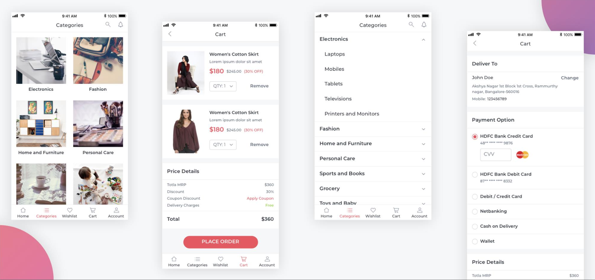
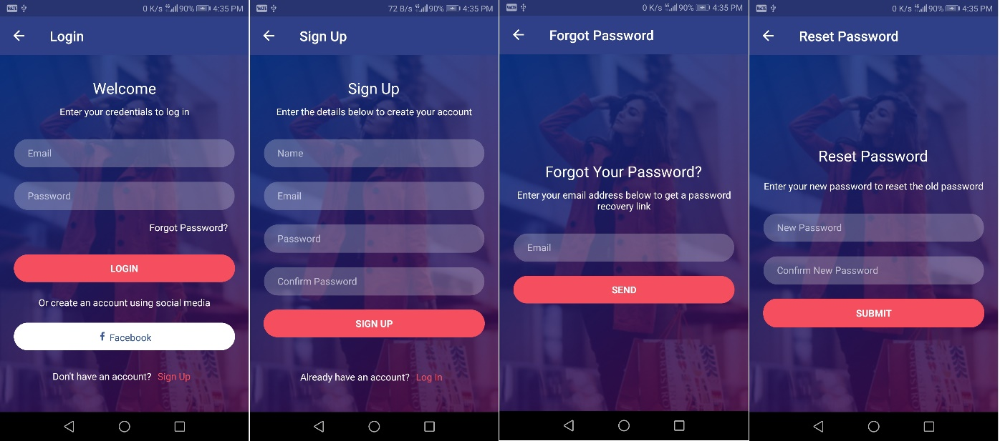
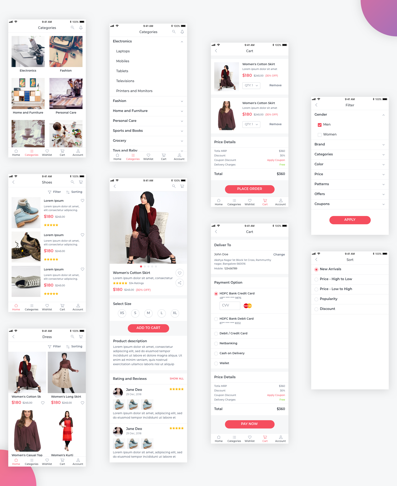

# Essential UI Kit for Xamarin.Forms
This repository contains the reusable UI templates to build a cross platform application using Xamarin.Forms. The templates developed from ground up by considering the different layouts, orientations, design pattern, RTL, localization, performance, ease of integration and more.

    

## Key Features
* Rich and elegant XAML layouts for most common scenarios.
* The layouts are optimized for Phones, Tablets, and Desktop.
* Based on the MVVM design pattern and works with any MVVM frameworks.
* Ease of integration.
* Developer friendly APIs.
* Appearance customization using styles.
* Optimistic layout to the get best possible performance.
* Right-to-Left rendering support.

## Supported Platforms
* Android 5.0 (or API level 21) and later versions.
* iOS 9.0 and later versions.
* UWP Build 17763 and later versions

The required minimum version of Xamarin.Forms is 4.0.0.425677.

## System Requirements
Refer to the [System Requirements](https://docs.microsoft.com/en-us/xamarin/cross-platform/get-started/requirements) documentation of Xamarin to learn more the development environments.

## The Visual Studio Extension
The Visual Studio extension allows you to add the required templates quickly through few clicks. The extension setup is available in the Visual Studio marketplace with detailed information of how to add the templates.

*VS Item template link*

## Coding Style (In Progress)
We follow the style used by the .NET Foundation, with a few exceptions:
* We use tabs instead of spaces.
* We do not prefix internal and private instance fields with `_`, static fields with `s_` and thread static fields with `t_`.

## Recent Blogs / News
* https://blog.syncfusion.com/post/introducing-ui-templates-for-xamarin-forms.aspx

## Screenshots (In Progress)

    

<i>Login Screens</i>

    

<i>E-Commerce Screens</i>

    

<i>Chat Screens</i>

## Requesting Screens & Reporting Bugs
If you would like to request a new screen or report a bug in existing screens, go ahead and create a feature request or log a bug through our [feedback portal](https://www.syncfusion.com/feedback/xamarin-forms).

## License
Licensed under the MIT License. Refer to the [LICENSE](LICENSE) file for more information.

**Note:** If any of the Syncfusion controls are used in your page, then you have to obtain the [Essential Studio for Xamarin](https://www.syncfusion.com/downloads/xamarin) license either under the [Syncfusion community license](https://www.syncfusion.com/downloads/communitylicense) program or the [Syncfusion commercial license](https://www.syncfusion.com/sales/products).

## About Syncfusion
Founded in 2001 and headquartered in Research Triangle Park, N.C., Syncfusion has more than 20,000 customers and more than 1 million users, including large financial institutions, Fortune 500 companies, and global IT consultancies.
Today we provide 800+ controls and frameworks for web ([ASP.NET Core](https://www.syncfusion.com/aspnet-core-ui-controls), [ASP.NET MVC](https://www.syncfusion.com/aspnet-mvc-ui-controls), [ASP.NET WebForms](https://www.syncfusion.com/jquery/aspnet-web-forms-ui-controls), [JavaScript](https://www.syncfusion.com/javascript-ui-controls), [Angular](https://www.syncfusion.com/angular-ui-components), [React](https://www.syncfusion.com/react-ui-components), [Vue](https://www.syncfusion.com/vue-ui-components) and [Blazor](https://www.syncfusion.com/blazor-components)), mobile ([Xamarin](https://www.syncfusion.com/xamarin-ui-controls), [UWP](https://www.syncfusion.com/uwp-ui-controls) and [JavaScript](https://www.syncfusion.com/javascript-ui-controls)), and desktop development ([WinForms](https://www.syncfusion.com/winforms-ui-controls), [WPF](https://www.syncfusion.com/products/wpf-ui-controls) & [UWP](https://www.syncfusion.com/uwp-ui-controls)). We provide ready-to deploy enterprise software for dashboards, reports, data integration, and big data processing. Many customers have saved millions in licensing fees by deploying our software.
